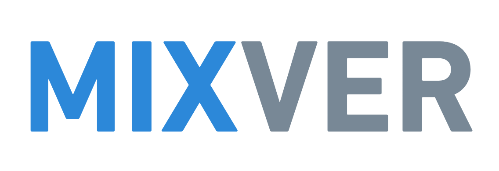

<!-- Improved compatibility of back to top link: See: https://github.com/othneildrew/Best-README-Template/pull/73 -->
<a name="readme-top"></a>
<!--
*** Thanks for checking out the Best-README-Template. If you have a suggestion
*** that would make this better, please fork the repo and create a pull request
*** or simply open an issue with the tag "enhancement".
*** Don't forget to give the project a star!
*** Thanks again! Now go create something AMAZING! :D
-->


<!-- PROJECT SHIELDS -->
<!--
*** I'm using markdown "reference style" links for readability.
*** Reference links are enclosed in brackets [ ] instead of parentheses ( ).
*** See the bottom of this document for the declaration of the reference variables
*** for contributors-url, forks-url, etc. This is an optional, concise syntax you may use.
*** https://www.markdownguide.org/basic-syntax/#reference-style-links
-->


<!-- PROJECT LOGO -->
<br />
<div align="center">
  <a href="https://github.com/hectorLop/mixver">
    
  </a>

  <p align="center">
    Custom versioning of ML models.
    <br />
    <br />
    <br />
  </p>
</div>


<!-- ABOUT THE PROJECT -->
## About The Project

Mixver is a versioning tool for ML models built enterily with Python. Its main capability is the ease of use and integration with different storage platforms such as AWS.


### Built With

* [![Python][Python-logo]][Python-url]


<!-- GETTING STARTED -->
## Getting Started


### Installation

Install the package using pip:
  ```sh
  pip install mixver
  ```

<!-- USAGE EXAMPLES -->
### Usage

This example shows how to version ML models locally.
First, we need to initialize the storage in the desired path.
```python
from mixver.storages.local_storage import LocalStorage

storage = LocalStorage(storage_path="local_folder/storage")
```

Once the storage it's initialized, we can push any model we want with its corresponding metadata.

```python
from sklearn.linear_model.LogisticRegression

model = LogisticRegression()
metadata = {"accuracy": 0.8}
name = "test_model"
tags = ["latest", "training"]

storage.push(model, name=name, metadata=metadata, tags=tags)
```

With this code we are versioning a LogisticRegression model that achieved an accuracy of 0.8 during training. Note that we also add two tags to it, the "latest" for representing the latest trained model, and the "training" tag to represent the model which best performed on the training data. Thus, we can retrieve the model which has this any of this tags assigned.

The following code retrieves the model with the tag "latest", which can be the newest model created. Besides, we can also retrieve the model with the "training" tag, which is the model that best performed in the training data.

On the other hand, we can also retrieve a model if we pass its name and version. In the case, we don't pass any specific version, it will return the newest version of the model

```python
# Get the model with "latest" tag
latest_model = storage.pull(tag="latest")
# Get the model with "training" tag
best_model_training = storage.pull(tag="training")

# Get the version 1 of "test_model"
model_version_1 = storage.pull(name="test_model", version="1")
# Get the latest version of "test_model"
model_latest_version = storage.pull(name="test_model")
```


<!-- ROADMAP -->
## Roadmap

- [ ] Show the models and their latest versions in the CLI
- [ ] Show the tags and their corresponding models in the CLI
- [ ] Add AWS S3 storage
- [ ] Add Google Drive storage


<!-- LICENSE -->
## License

Distributed under the MIT License. See `LICENSE.txt` for more information.


<!-- CONTACT -->
## Contact

Hector Lopez Almazan - [@hectorLop_](https://twitter.com/hectorLop_)- lopez.almazan.hector@gmail.com


[Python-logo]: https://img.shields.io/badge/Python-3776AB?style=for-the-badge&logo=python&logoColor=white
[Python-url]: https://www.python.org
